# Google Docs Correctness DAG

This directory contains the machine-readable correctness argument for the Google Docs–style collaborative editor described in `../design/google-docs.md`. The DAG is not a formal proof. It records what must be true and what each claim depends on; orthogonal assurance state records how far specification coverage, proof composition, and executable leaf evidence have actually been reviewed.

## Files

- `correctness.yaml` — canonical correctness model, typed catalog, proof DAG, assumptions, refinement state, and orthogonal assurance state.
- `correctness.py` — deterministic validator, slicer, catalog browser, invalidation engine, scheduler, semantic-signature engine, and structured mutation writer.
- `graph_schema.py` — closed JSON-Schema/type definitions for the canonical YAML and mutation payloads.
- `test_correctness.py` — regression tests for the correctness control plane.
- `requirements.txt` — Python dependencies.
- `generated/` — generated proof/audit artifacts that are useful to keep under version control.

Repository-level agent guardrails live in `../AGENTS.md`; the detailed operational workflow is generated by `python3 correctness.py workflow-help`. `../history/` is ignored local scratch for temporary mutation plans or diagnostics, not current specification or durable project history.

## Why one canonical YAML

The model intentionally remains one logical document. The important operations—cycle detection, root reachability, dependency closure, reverse invalidation, catalog validation, semantic signatures, and atomic mutation—operate over the whole graph. `correctness.py` isolates agents from the physical file size through typed commands and local proof slices, so splitting storage would currently add cross-file atomicity and merge semantics without reducing reasoning complexity.

If the project later reaches stable subsystem ownership boundaries, the physical representation may be split behind the same loader/mutation interface. The logical graph should remain unified.

## Useful commands

```bash
cd correctness
python3 -m pip install -r requirements.txt
python3 correctness.py graph-schema --format yaml
python3 correctness.py schema-fields --format text
python3 correctness.py mutation-schema --format yaml
python3 correctness.py validate
python3 correctness.py refinement-status --format compact-yaml
python3 correctness.py assurance-status --format compact-yaml
python3 correctness.py coverage-audit-prompt
python3 correctness.py composition-status --format compact-yaml
python3 correctness.py composition-audit-prompt <ROOT_OR_DERIVED> --focus execution
python3 correctness.py catalog mechanisms
python3 correctness.py catalog semantic_contracts
python3 correctness.py slice G1_retry_is_logically_exactly_once --format prompt
python3 correctness.py audit-prompt <RUNNABLE_NODE>
python3 correctness.py invalidate <CHANGED_NODE>
python3 correctness.py render <NODE>
python3 -m unittest -v test_correctness.py
```

All writes to `correctness.yaml` go through `correctness.py mutate`; see `../AGENTS.md` and `python3 correctness.py workflow-help` for the controlled mutation/refinement protocol.

## Closed typed schema

`correctness.yaml` is a closed typed document before graph-level semantic checks run. Unknown properties are rejected instead of silently becoming metadata. A regression test recursively asserts that every object shape in the canonical JSON Schema is closed with `additionalProperties: false`.

The fixed top-level structure is intentionally small:

```text
schema_version     schema contract version
system             global system summary + liveness boundary
source             architecture source document
scope              modeled / intentionally unmodeled product-protocol concerns
catalog            typed vocabulary, semantic contracts, and architecture registries
id_allocator       persisted next-ID counters only
assumptions        dynamic A<n> terminal proof boundaries
roots              top-level G<n> guarantees
claims             dynamic G/C/L propositions
refinement         decisions, tooling blockers, and per-claim refinement maturity
assurance          specification coverage + composition review + leaf implementation evidence
```

Only identity-keyed maps have dynamic field names: assumption IDs, claim IDs, decision IDs, tooling-blocker IDs, refinement/assurance claim IDs, and catalog entry IDs. Their key formats are still regex-constrained. Everything else has an explicit schema field set and enum/type contract.

Examples:

```text
claim.kind                 root | derived | leaf
claim.severity             critical | high
claim.assurance_required   maximal | strong
claim.depends_on           typed node refs + kind-conditional presence
claim.semantic_contracts   typed reusable safety/equivalence boundaries
verification.verifiers     typed verifier kind + intent
refinement.status          pending | stable | waived
assurance.specification    unaudited | gap_found | closed
assurance.composition      unaudited | single_agent_audited | multi_agent_audited | machine_checked
assurance.evidence         planned | implemented | passing | failing
catalog entry shapes       closed per namespace
```

`depends_on`, catalog references, node IDs, and nested verifier/evidence objects also have structural types. After JSON-Schema validation, `correctness.py validate` performs the properties that require graph semantics rather than local shape: dangling edges, duplicate/self dependencies, cycles, root reachability, ID-role consistency, catalog foreign keys, semantic signatures, and refinement scheduling invariants.

Leaf claims are terminal proof boundaries: they must declare `surfaces`, `mechanisms`, and `verification`, and they may not declare `depends_on`. If a new field or enum value becomes genuinely necessary, update the schema deliberately instead of letting an agent invent it ad hoc.

### Model semantics vs tool policy

`schema_version: 0.11` adds an orthogonal assurance layer without changing proposition semantics or the refinement scheduler. `stable` remains refinement maturity only; specification completeness, dependency-composition review, and executable leaf evidence are tracked separately. The 0.10 source-traceability model remains unchanged: `catalog.sources` is keyed by stable semantic IDs and stores only the exact semantic H2 `heading`; Markdown numeric prefixes such as `6.` are presentation only. Earlier cleanup removed fields that looked configurable or stateful but carried no independent information: `refinement.policy`, `node_id_policy.format/meanings/rules`, `composition_rules`, `status_legend`, YAML-level interpretation-rule prose, `claim.status: specified`, `verification.status: planned`, repeated evidence policy, persisted refinement `task/priority`, and the redundant source `section/title/description` triple.

The rule is now:

```text
If changing a value may legitimately change the system/proof model
    → keep it in correctness.yaml and include it in semantic invalidation where relevant.

If the value defines how correctness.py itself works
    → keep it in code/schema/workflow-help, not as pseudo-configuration in YAML.
```

For example, bottom-up scheduling and `HUMAN_BLOCKED` / `TOOLING_BLOCKED` are scheduler semantics implemented by `correctness.py`; `id_allocator.next_sequence` remains in YAML because it is mutable persisted state. `system.summary`, `scope`, and `system.liveness_boundary` remain because they constrain what a verifier may assume. Changes to those global semantic fields change proof signatures and reopen affected stable proofs.

The top-level fields therefore have explicit consumers:

| Field | Role | Consumed by |
| --- | --- | --- |
| `schema_version` | canonical document contract version | JSON-Schema validator / migration gate |
| `system.id` | stable model identity | generated audit context / tooling display |
| `system.summary` | global neutral system semantics | audit-prompt + semantic signature |
| `system.liveness_boundary` | global liveness boundary | audit-prompt + semantic signature |
| `source.article` | canonical architecture traceability | source validation + specification-coverage signature; not a local proof premise |
| `scope` | modeled vs intentionally unmodeled protocol/product concerns | audit-prompt + semantic signature |
| `catalog` | typed vocabulary, semantic contracts, mechanisms, failure model, surfaces, verifier/source registries | validator + prompt generation + synthesis guard + signatures |
| `id_allocator.next_sequence` | persisted writer allocator state | `mutate` only; not proof semantics |
| `assumptions` / `claims` / `roots` | correctness propositions and proof graph | slicer + validator + invalidation + scheduler |
| `refinement` | proposition/decomposition maturity and human/tool blockers | scheduler + stable-signature/OCC workflow |
| `assurance` | orthogonal confidence provenance | root-coverage signature + composition audit state + executable leaf evidence state |

If a future top-level field cannot be assigned a similarly concrete consumer, it probably does not belong in the canonical YAML.

## 先固定系统模型

这篇文章最核心的架构判断可以压成一句：

```text
canonical truth
=
snapshot(frontier=S)
+ accepted-change-set log after S
```

因此 DAG 也故意不围绕组件组织。`WebSocket Gateway`、`OT Owner`、`PostgreSQL` 都只是 correctness claim 的实现 surface。

权威状态：

```text
accepted_change_log
document_latest_revision
document_current_epoch
snapshot_content + snapshot_revision
```

派生状态：

```text
OT owner memory
WebSocket live stream
client local document
cache / search index
```

## Typed catalog + system context

The `catalog` is the registry for reusable names that carry stable domain meaning:

```text
catalog.terms            protocol vocabulary and snake_case shorthand
catalog.state            authoritative / derived state
catalog.mechanisms       architecture mechanisms + automation reuse authority
catalog.semantic_contracts  reusable safety/equivalence semantics + automation reuse authority
catalog.failure_events   allowed / excluded failure model
catalog.surfaces         change-impact / implementation surfaces
catalog.verifier_kinds   small stable evidence taxonomy
catalog.sources          stable semantic source identity → exact H2 heading traceability
```

Every catalog namespace has a closed schema. A snake_case protocol/state/semantic identifier such as `client_change_id`, `latest_revision`, `document_current_epoch`, or `logical_state_equivalence_at_frontier` used in a proposition must resolve to the typed catalog; verifier and agent memory are not allowed to supply an implicit definition.

`semantic_contracts` are deliberately stronger than glossary terms but weaker than proof nodes. They define *what a proposition means*—for example which observations count in an equivalence relation and which stronger liveness/history guarantees are excluded. Referencing a semantic contract does not establish that the contract holds; the claim's dependencies/evidence still have to prove the proposition. Contract definitions participate in semantic signatures, so changing the abstraction boundary reopens only the claims that reference it.

A semantic-contract reference is also required to be explicit in both model and source prose. If a claim declares `semantic_contracts: [X]`, the exact identifier `X` must occur in that claim's `statement` or `formal_intent`, and must also occur in at least one `source_refs` section of `source.article`. Validation resolves each stable source ID through its exact `heading`; a leading numeric Markdown prefix such as `## 6.` is ignored when matching. This prevents a contract from existing only as hidden YAML metadata or from being "supported" by an unrelated occurrence elsewhere in the article.

The catalog is also the architecture/semantic-synthesis boundary. Automation may reference only existing mechanisms marked `automation_reusable: true`, and may attach an approved reusable semantic contract when creating a new proof-structure claim. Once a claim exists, changing or removing its `semantic_contracts` association requires human authority because that changes the proposition's interpretation boundary. If a proof hole requires a new state variable, lock, phase, generation, queue, reservation, transaction primitive, or a new semantic contract, the branch must stop for human judgment rather than silently inventing it.

`surfaces` and `verifier_kinds` are likewise closed taxonomies. Scenario-specific detail belongs in verifier `intent`, not in a newly invented verifier type.

Global system context is no longer stored in a generic `reasoning_context` prose bag. Schema 0.7 gives the semantically relevant pieces explicit homes:

```yaml
system:
  id: google_docs_mini
  summary: ...
  liveness_boundary: ...

scope:
  includes: [...]
  excludes: [...]
```

`system.summary`, `scope`, `system.liveness_boundary`, and the global `catalog.failure_events` are injected into local proof audits and participate in recursive semantic signatures. A change to them therefore reopens previously stable reasoning instead of silently changing the proof universe.

The audit interpretation rules themselves are tool semantics, not system configuration. They are defined in `correctness.py` and emitted by `audit-prompt`; changing those rules requires a tooling change and an explicit `PROOF_SEMANTICS_VERSION` bump rather than editing arbitrary YAML prose.

Generated local context therefore looks conceptually like:

```text
system summary + scope + liveness boundary
+ relevant catalog definitions
+ global failure model
+ tool-defined interpretation rules
        ↓
local proof slice
        ↓
adversarial verification task
```

Catalog definitions can be queried without opening the full YAML:

```bash
python3 correctness.py catalog terms client_change_id
python3 correctness.py catalog mechanisms
python3 correctness.py catalog semantic_contracts --format yaml
python3 correctness.py catalog verifier_kinds --format yaml
```

## Root claims

当前收敛成六个 root：

| ID | Root correctness claim |
| --- | --- |
| `G0` | 已 ACK 的 edit 已进入 durable canonical history，并能跨 owner failover 恢复 |
| `G1` | ACK 丢失 / reconnect / retry 不会让一个 logical edit 被 accepted 两次 |
| `G2` | 每个 document 的 canonical history 是单一、连续、受 fencing 保护的 revision sequence |
| `G3` | snapshot / compaction / recovery 与从头 replay canonical history observationally equivalent |
| `G4` | reconnect client 最终收敛到 canonical state，不漏 revision、不 double apply |
| `G5` | retry 如果对应已有 acceptance，就解析回原 canonical result，而不是创建新的 logical operation |

这里没有单独把“OT transform algorithm 正确”伪装成已经证明的 claim。原文明说 transformation function 不在讨论范围内，所以它被显式建模为 `A2_ot_engine_is_correct` 外部假设。以后真要做 model checking，可以把这个 assumption 换成一个有 evidence 的 subtree。

## Top-level DAG

```mermaid
graph TD
    A1[A1 storage commit durable]
    A2[A2 OT engine correct]
    A3[A3 change id identifies logical edit]
    A4[A4 eventual reconnect]
    A5[A5 deterministic apply]

    C1[C1 commit precedes ACK]
    C5[C5 transform uses committed head]
    C6[C6 atomic acceptance transaction]
    C7[C7 linear revision frontier]
    C8[C8 stale owner fenced]
    C9[C9 recovery reconstructs committed state]
    C10[C10 catch-up is exact missing suffix]
    C11[C11 client applies contiguous revisions]
    C12[C12 live stream only exposes accepted changes]
    L1[L1 current idempotency record unique]
    L2[L2 retry returns existing acceptance]
    L13[L13 idempotency key temporally unique]
    L14[L14 accepted identity survives lifecycle]
    L15[L15 all acceptance paths honor identity]

    G0[G0 ACKed edit survives failover]
    G1[G1 logical retry exactly-once]
    G2[G2 canonical history linear + fenced]
    G3[G3 snapshot/recovery preserves state]
    G4[G4 reconnect converges]
    G5[G5 retry resolves idempotently]

    C1 --> G0
    C6 --> G0
    C9 --> G0
    A1 --> G0

    L1 --> L13
    L14 --> L13
    L15 --> L13
    L13 --> G1
    A3 --> G1

    C5 --> G2
    C6 --> G2
    C7 --> G2
    C8 --> G2

    C9 --> G3
    A5 --> G3

    C10 --> G4
    C11 --> G4
    C12 --> G4
    G2 --> G4
    G3 --> G4
    A2 --> G4
    A4 --> G4
    A5 --> G4

    L1 --> G5
    L2 --> G5
    A3 --> G5
```



`C6`、`C9` 等 intermediate claim 继续向下展开到真正可以交给 verifier 的 leaf。完整依赖关系以 YAML 为准。

G1 现在刻意区分两个不同层次的 invariant：`L1` 只描述“当前 authoritative state 中，同一个 idempotency key 最多一条 accepted record”；`L13` 描述更强的 temporal safety——即使经历 recovery、compaction 或其他 history lifecycle，同一个 key 也不能在之后重新触发第二次 acceptance event。进一步审计后，`L13` 已从 leaf 下沉为 derived claim：它复用 `L1` 处理并发/current-state uniqueness，并新增 `L14` 保证 accepted-key identity 不会被 lifecycle 遗忘、`L15` 保证所有 acceptance-producing path 都必须服从该 identity。这样每个 leaf 都对应不同 failure surface 和 verifier，而 G1 仍只依赖最小的 temporal proposition。

## 一个 leaf 应该长什么样

例如文章里的：

> server 只能在 durable append 成功后 ACK。

在 graph 里不是一句 prose，而是：

```yaml
L16_commit_precedes_ack:
  kind: leaf
  statement: >-
    The server emits a success ACK for an edit only after the corresponding
    canonical accepted change has committed to the authoritative store.
  formal_intent: "ack(edit_id) => committed(edit_id)"
  source_refs: [accepted_change_log, owner_failover, final_architecture]
  surfaces: [acceptance_path, accepted_history_store]
  mechanisms: [acceptance_transaction, accepted_history_log, server_authoritative_ot]
  verification:
    status: planned
    verifiers:
      - kind: control_flow
        intent: Every success-ACK path is dominated by successful durable commit.
      - kind: integration_test
        intent: Crash after commit/before ACK; retry must recover the committed result.
```

这一版仍允许 `statement` 是自然语言，因为我们还在验证 DAG 这种组织方式本身。但所有结构化 shorthand、mechanism、surface 和 verifier kind 都必须先进入 typed catalog；具体 scenario 留在 verifier `intent` 中。后面如果继续做 DSL，应该优先从这些 leaf 开始，而不是把整篇文章重新形式化一遍。

## 当前拆出来的核心 leaf

YAML 里目前覆盖了文章里最硬的那些 failure boundaries：

```text
persist-before-ack
commit-before-broadcast
current idempotency-record uniqueness
idempotency-key temporal acceptance uniqueness
retry returns existing acceptance
(document_id, revision) uniqueness
append requires latest_revision == r - 1
append requires current owner_epoch
accepted row + frontier atomic commit
ownership takeover monotonically bumps epoch
snapshot is exact committed prefix
snapshot content + frontier atomic publication
replay exact tail in order exactly once
OT metadata reconstructable from persisted truth
catch-up reads exact canonical revision range
client only applies contiguous revisions
```

这些 leaf 基本都已经能映射到明确的 deterministic verifier，而不是继续依赖“大模型读完代码觉得没问题”。

这里的停止条件属于 **proof tooling semantics**，不是 Google Docs 系统语义，所以不会写进 `correctness.yaml`。`correctness.py` 用单一 `LEAF_STOPPING_SIGNALS` registry 定义可直接交给实现级机械证明的典型边界，并由 `workflow-help` 与 `audit-prompt` 共同渲染。核心规则是 single-verifier sufficiency：如果完整 proposition 已经能由一个局部 deterministic checker（纯函数/transition、schema constraint、control-flow、static dataflow、bounded state machine、symbolic/differential check 等）直接判定，默认停止拆分；verifier 内部有多个 assertions 不等于需要多个 DAG nodes。

## Edge 的含义

YAML 里的声明方向和可视化箭头要明确区分：

```yaml
A:
  depends_on:
    - B
```

表示：**A 的 correctness argument 依赖 B 成立。**

为了让 invalidation propagation 更直观，Mermaid / rendered graph 画成：

```text
B -> A
```

也就是 dependency 指向 dependent。这样 B 失效时，可以沿箭头直接找到所有需要重新验证的 parent claim。两种表示都不描述运行时调用关系或组件数据流。

所以如果将来修改：

```text
L5 append_requires_current_epoch
```

那么：

```text
L5
→ C6 atomic acceptance
→ G0 ACK durability

L5
→ C8 stale owner fenced
→ G2 canonical history
→ G4 reconnect convergence
```

这些 transitive parents 都应该进入 `INVALIDATED / NEEDS_REVERIFY`。

这就是我们上一轮讨论里那个“correctness 层面的 build dependency”。

## Assumption 也必须进入图

第一版故意把 assumption 当一等公民，而不是藏在 prose 里。

例如：

```text
A1 storage commit success really means crash-durable
A2 OT engine itself satisfies its convergence contract
A3 one logical edit keeps one client_change_id across retries, and distinct edits use distinct IDs
A4 transient failure eventually heals enough for reconnect/retry
A5 applying a canonical accepted sequence is deterministic
```

如果 deployment model 改变，例如把数据库 durability 从 synchronous replication 改成 weaker semantics，`A1` 就必须被重新审查，所有依赖它的 root 也自然失效。

## Assurance / evidence policy

这一版仍然没有把 claim 本身标成 `verified`。`verification.verifiers` 只描述准备如何获得机械证据；实际执行状态进入独立的 `assurance.implementation_evidence.<leaf>`，而不是污染 claim proposition。`passing` 必须绑定 leaf semantic signature、具体 implementation revision 和 evidence artifact refs；claim 语义变化后 harness 会把旧结果有效地显示为 `stale`。

同样，`refinement.status: stable` 只表示 proposition/decomposition 已经收敛。non-leaf 的 `dependencies ⇒ target` 可信度由 `assurance.composition` 单独记录；全局 root universe 是否完整由 `assurance.specification_coverage` 单独记录。三类 assurance 与 refinement scheduler 正交。

Refinement 完成后有两条独立的 reasoning certification pipeline。`coverage-audit-prompt` 生成全局 root-coverage/specification-completeness campaign：假设整个 DAG 都成立，继续寻找 scope 内的 material failure，并检查 root/scope/assumption 是否相对 canonical design 发生了语义缩窄。`composition-status` 则列出所有尚未达到至少 `multi_agent_audited` 的 root/derived nodes；对每个 node，`composition-audit-prompt NODE --focus ...` 只暴露 target 与 direct premises，不递归打开 grandchildren。推荐的 focus 是 `execution`、`quantifier`、`premise`，maximal root 额外使用 `general` 作为第四个独立攻击视角。

Composition campaign 的终止条件不是“每个 node 至少问过一个 agent”，而是所有 non-leaf 都达到当前有效的 `multi_agent_audited` 或 `machine_checked`。任何 surviving `deps=true,target=false` counterexample 都必须先被 challenger 尝试击杀，再由 orchestrator 判断是否需要修改 DAG。

“证据必须尽量独立于被验证机制本身”现在是 correctness tooling 的全局 audit rule，而不是每个 leaf 重复：

```text
implementation agent says implementation is correct
```

不能作为 evidence。crash test 必须真的 crash/reload；schema constraint 必须读取真实 schema；replay equivalence 必须独立重建 state。因为这是一条 verifier methodology，而不是每个 claim 各自可配置的 policy，所以 schema 0.8 删除了 44 份完全相同的：

```yaml
evidence_policy:
  independent_observation_required: true
```

对应的解释规则由 `correctness.py` 注入 audit prompt，并参与 proof semantic signature。

## 这版刻意没有做的事情

暂时没有：

- 设计完整 formal DSL；
- 把 `formal_intent` 编译成 SMT / CHC；
- 给 node 打虚假的 confidence score；
- 把所有产品行为都塞进 graph；
- 写 mini implementation；
- 生成几十页自然语言 spec。

第一阶段先验证两个问题：

```text
1. 文章里的 correctness reasoning 能不能无歧义地落成 DAG？
2. DAG 拆到 leaf 后，能不能自然得到局部、独立、可执行的 verifier？
```

如果这两件事成立，再往下做 implementation / invalidation engine / verifier runner 才有意义。
